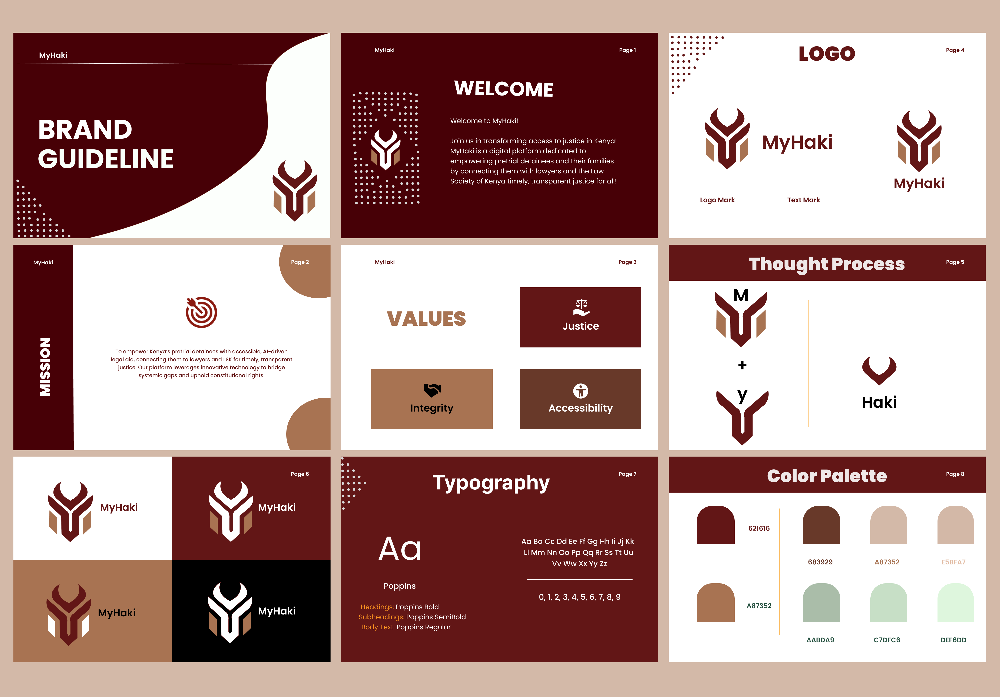

# Brand Guideline

## Logo Usage

- Always use the official MyHaki logo (`images/myhaki-logo.png`) with proper clear space and sizing.
- Do not distort, recolor, or overlay the logo on busy backgrounds.

---

## Official Colors

| Name      | HEX      | Usage                      |
|-----------|----------|---------------------------|
| Deep Red  | #621616  | Primary, Buttons, Links   |
| Brown     | #A87352  | Accent, Highlights        |
| Cream     | #F6E9E0  | Backgrounds, Banners      |
| Dark      | #232f3e  | Text, Icons               |

---

## Typography

- **Headings:** Poppins, Bold
- **Body:** Poppins, Regular
- **Code:** Fira Mono

---

## Imagery & Icons

- Use law-themed imagery: gavels, scales, parchment.
- Avoid stock photos unrelated to justice or Kenya.

---

## Voice & Messaging

- Values: Justice, Integrity, Accessibility
- Tone: Trustworthy, inclusive, authoritative

---

## Example Application

- Android app and dashboard use deep red banners, rounded cards, and Poppins font.
- All interfaces show the logo on splash and navigation.

---
