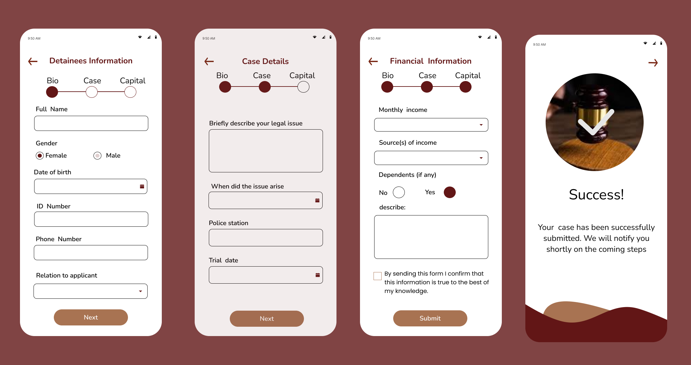
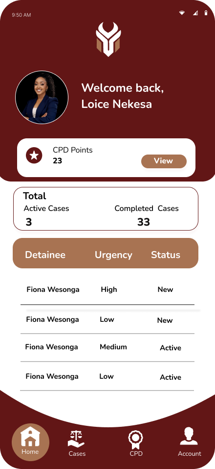

# Platform Features

Explore the core features of **MyHaki**, designed to streamline access to legal aid for pretrial detainees, empower lawyers, and enable the Law Society of Kenya (LSK) to monitor and coordinate justice delivery.

---

## 1. Case Application & Tracking (Android App)

- <b>Accessible Case Submission:</b>  
  Detainees and their families submit case applications via the Android app, entering personal details, case descriptions, and supporting documents.
- <b>Eligibility & Verification:</b>  
  The app guides users through basic eligibility checks and captures proof for legal aid.
- <b>Status Updates & Notifications:</b>  
  Users receive real-time notifications for every case event—verification, assignment, in-progress, and resolution.
- <b>Secure Messaging:</b>  
  Communicate directly with assigned lawyers inside the app.
- <b>Low-End Device Support:</b>  
  Optimized for informal settlements and low-income users.

---

## 2. Lawyer Android App Dashboard

- <b>Assigned Case Management:</b>  
  Lawyers access a dashboard showing all cases assigned to them, updated in real time.
- <b>Case Details & Progress Reporting:</b>  
  View case specifics, update statuses, submit progress reports, and communicate securely with clients.
- <b>CPD Points & Rewards:</b>  
  Track Continuing Professional Development points earned via pro bono work.
- <b>Real-Time Notifications:</b>  
  Receive alerts about new cases, deadlines, and messages.

---

## 3. AI-Assisted Case Filtration & Assignment

- <b>Agentic AI Filtration:</b>  
  AI automatically filters and prioritizes cases (civil, criminal, urgency) using NLP and Kenyan legal data.
- <b>TranslatePlus Integration:</b>  
  Kiswahili case descriptions are translated to English, improving classification accuracy.
- <b>Geolocation Matching (LocationIQ):</b>  
  Police station addresses are geocoded, enabling proximity-matching between detainees and lawyers.
- <b>Automated Assignment:</b>  
  Celery + Redis automate lawyer assignment based on specialty, location, and workload, using Haversine formula for distance calculations.
- <b>Equitable Distribution:</b>  
  The system prevents lawyer overload and ensures fair case allocation.

---

## 4. LSK Admin Dashboard (Web)

- <b>Oversight & Case Monitoring:</b>  
  LSK administrators view all active cases, assignments, and lawyer activities.
- <b>Reporting & Analytics:</b>  
  Monthly reports, dashboards, and charts show case volumes, resolution times, lawyer performance, and assignment metrics.
- <b>Reward Management:</b>  
  Allocate and manage CPD points for lawyer activities.
- <b>Compliance & Audit Logging:</b>  
  Track all actions for regulatory compliance and transparent governance.

---

## 5. Secure Authentication, Communication & Data Management

- <b>Role-Based Access Control:</b>  
  Segregated interfaces and permissions for detainees, lawyers, and LSK admins.
- <b>Encrypted Data Storage:</b>  
  All sensitive data (case records, messages, tokens) is encrypted at rest and in transit.
- <b>Audit Trails:</b>  
  Every user action and system event is logged for analytics and compliance.

---

