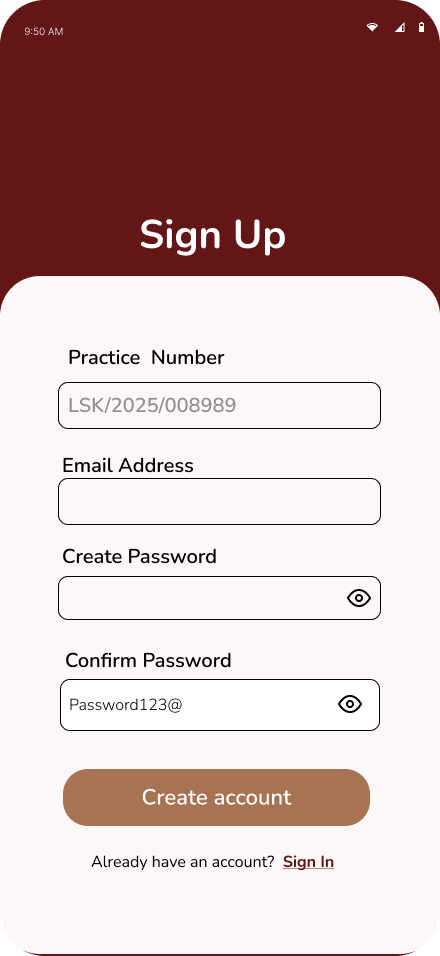
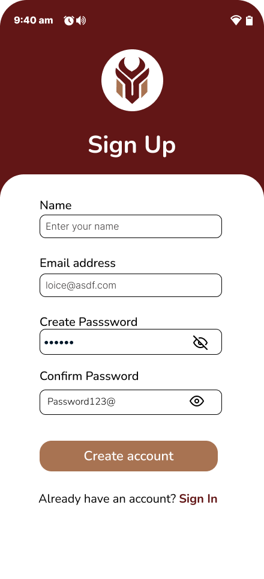
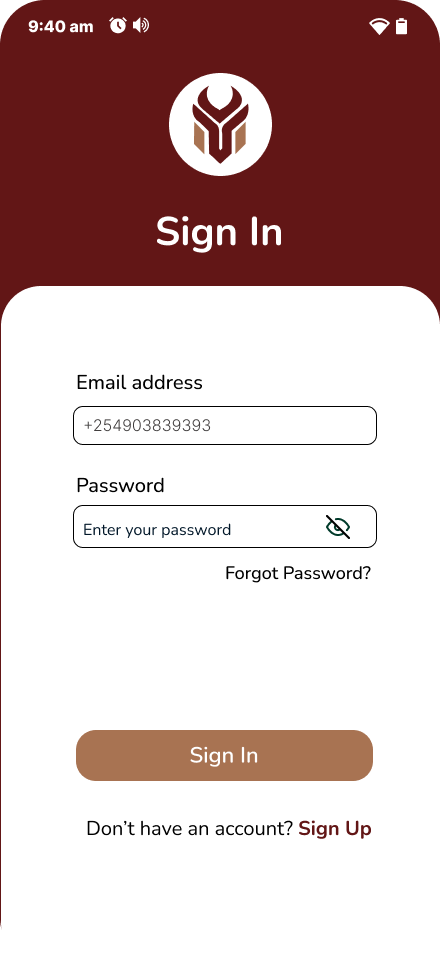
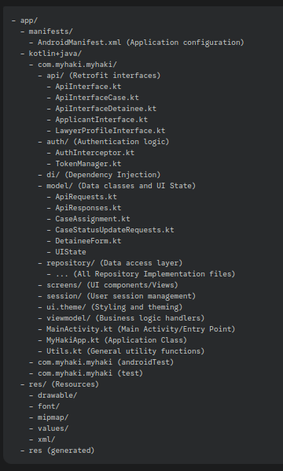

# Getting Started

Welcome to **MyHaki**! This guide walks you through onboarding, authentication, and password management for Applicants (Detainees/Families), Lawyers, and LSK Admins—with real API snippets and backend code.

---

## 1. User Onboarding Flows

#### A. Lawyer Onboarding (Android App)
- **Fields:** Practice Number, First Name, Last Name, Email Address, Password

**API Endpoint:**  
<pre class="api-dark">POST /register-lawyer/</pre>

**Sample Request (from Swagger):**
<pre class="api-dark">
{
  "practice_number": "LSK/2025/008989",
  "first_name": "Loice",
  "last_name": "Nekesa",
  "email": "loice.lawyer@example.com",
  "password": "Password123@"
}
</pre>

**Sample Response:**
<pre class="api-dark">
{
  "practice_number": "LSK/2025/008989",
  "first_name": "Loice",
  "last_name": "Nekesa",
  "email": "loice.lawyer@example.comm",
  "verified": true
}
</pre>

---

### B. Applicant/Detainee Onboarding (Android App)
- **Fields:** First Name, Last Name, Email, Password, Role

**API Endpoint:**  
<pre class="api-dark">POST /signup/</pre>

**Sample Request (from Swagger):**
<pre class="api-dark">
{
  "first_name": "Fiona",
  "last_name": "Wesonga",
  "email": "fiona.applicant@example.com",
  "password": "Password123@",
  "role": "applicant"
}
</pre>

**Sample Response:**
<pre class="api-dark">
{
  "id": 11,
  "first_name": "Fiona",
  "last_name": "Wesonga",
  "email": "fiona.applicant@example.com",
  "role": "applicant",
  "created_at": "2025-10-01T20:41:01Z"
}
</pre>

 

---

## 2. Authentication & Security

**Login API (All Users):**  
<pre class="api-dark">POST /login/</pre>

**Sample Request:**  
<pre class="api-dark">
{
  "email": "user@example.com",
  "password": "Password123@"
}
</pre>

**Sample Response:**  
<pre class="api-dark">
{
  "token": "authentication-token-string"
}
</pre>

---

## 3. Forgot Password, OTP Verification & Reset Flow (All Users)

**Step 1: Initiate Password Reset**  
<pre class="api-dark">POST /forgotpassword/</pre>
<pre class="api-dark">
{
  "email": "user@example.com"
}
</pre>
_Response:_
<pre class="api-dark">
{
  "message": "Password reset code sent."
}
</pre>

**Step 2: Verify Code**  
<pre class="api-dark">POST /verifycode/</pre>
<pre class="api-dark">
{
  "email": "user@example.com",
  "code": "1234"
}
</pre>
_Response:_
<pre class="api-dark">
{
  "detail": "Code verified. Proceed to reset password."
}
</pre>

**Step 3: Reset Password**  
<pre class="api-dark">POST /resetpassword/</pre>
<pre class="api-dark">
{
  "email": "user@example.com",
  "password": "NewSecurePassword@"
}
</pre>
_Response:_
<pre class="api-dark">
{
  "detail": "Password reset successful."
}
</pre>

---

## 4. First Steps After Login

- **Applicants:**  
  - Submit new case applications, upload documents, and track case status.
  - Receive notifications for every case update.

- **Lawyers:**  
  - View assigned cases, update progress, submit reports, and monitor CPD points.
  - Real-time notifications for new assignments and deadlines.

- **LSK Admins:**  
  - Monitor overall case flow, assign lawyers, and generate compliance reports.

---

## 5. Security & Support

- All authentication flows use secure HTTPS and encrypted storage.
- For help, access support via the app or dashboard.

---

**Code standards**

- **Architecture:** MVVM, repository pattern, Koin for DI.
- **Naming:**
  - camelCase for variables and methods
  - PascalCase for classes, composables, ViewModels
  - SCREAMING_SNAKE_CASE for constants
- **File Structure:** Group by feature, separate data/model/viewmodel/ui.
- **Testing:** Use JUnit, MockK for unit tests; Compose Test for UI.
- **Dependency Injection:** Always inject dependencies via Koin modules.
- **Secure Storage:** Use EncryptedSharedPreferences for sensitive data.
- **Accessibility:** Use Compose’s accessibility APIs for labels, hints, focus.

## Code Structure

---

# Deployment Process
---

## Mobile Deployment (Android App)

- **Platform:** Google Play Console (Production), Firebase App Distribution (Testing)
- **Build:** Release builds via Gradle (`assembleRelease`), signed with team keystore
- **Environment Variables:** API URLs, keys stored in `local.properties` and encrypted secrets
- **CI:** GitHub Actions runs unit/UI tests on push; releases only after passing all tests
- **Brand Compliance:** All assets, colors, and typography must match MyHaki guidelines

**Steps**

 - Feature development occurs on dedicated branches.  
  - Changes are pushed to GitHub, triggering automated unit and UI tests through GitHub Actions.  
  - Upon successful tests, the Gradle build process is initiated using `assembleRelease`.  
  - The generated APK is signed using the team’s keystore.  
  - Environment variables such as API URLs and keys are securely managed via `local.properties` and encrypted secrets.  
  - Release APKs are distributed through two channels:  
  - Firebase App Distribution for testing builds.  
  - Google Play Console for production release.  
  - Prior to submission, all assets and UI elements are verified to meet MyHaki’s brand compliance standards.  
  - The production APK is published officially on Google Play after all validations. 
---

