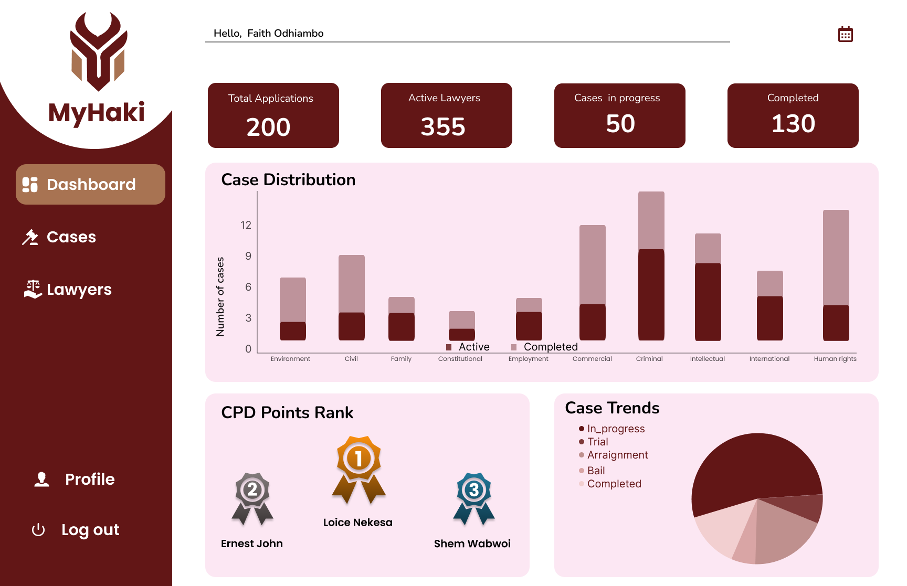

# Welcome to MyHaki

  

    
    <h2>Justice. Integrity. Accessibility.</h2>
    
A legal aid provision system for underserved pretrial detainees

  

  

    
    <h2>Case Management. Pro Bono Tracking. Analytics.</h2>
    
Empowering LSK and lawyers for transparent justice delivery

  

  

    
    <h2>Accessible Onboarding for All</h2>
    
Mobile-first for low-income families and lawyers

  

  

    
    
    
  

  <a href="https://my-haki-informational-website.vercel.app/" class="md-button">Informational Website</a>
  <a href="getting-started/" class="md-button">See what's next</a>

---

  <strong>MyHaki</strong> is an AI-driven case management system, 
  connecting lawyers with underserved pretrial detainees, streamlining access to legal aid and  enabling the Law Society of Kenya to monitor case progress and incentivize lawyers through rewards thereby enhancing access to justice.
 

---

## Why MyHaki?

  <h3>Agentic AI Case Filtration</h3>
  
Classifies, and prioritizes cases (civil/criminal, urgency) for fair assignment.

  <h3>Geolocation Matching</h3>
  
Assigns lawyers based on proximity using LocationIQ and the Haversine formula.

  <h3>Secure Android App for Lawyers & Applicants</h3>
  
Mobile-first onboarding, case tracking, CPD points tracking, and case dashboards.

  <h3>LSK Oversight Dashboard</h3>
  
Next.js-powered web interface for admin, compliance, analytics, and reporting.

  <h3>Compliance & Data Protection</h3>
  
Built on Legal Aid Act 2016 and Kenya Data Protection Act, with encrypted storage and audit trails.

  <h3>API-First Architecture</h3>
  
All features accessible via robust REST APIs (<a href="api-reference/">see API Reference</a>).

---

## Platform Highlights

  

---

  <strong>Our Mission:</strong> <em>Enhance access to justice for Kenya’s most vulnerable. 
  Enable fast, fair, and transparent legal aid service delivery powered by technology.</em>

---

> _Learn more about MyHaki on our [Website](https://my-haki-informational-website.vercel.app/)._  
> _Ready to get started? [Start here](getting-started.md)!_

