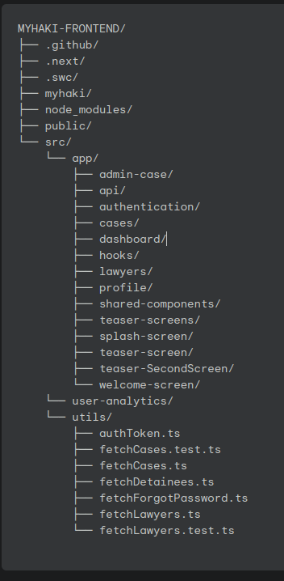

## 1. User Onboarding Flows

### LSK Admin Onboarding (Web Dashboard)
- **Fields:** Email, Password

**API Endpoint:**  
<pre class="api-dark">POST /login/</pre>

**Sample Request (from Swagger):**
<pre class="api-dark">
{
  "email": "admin.lsk@example.com",
  "password": "Password123@"
}
</pre>

**Sample Response:**
<pre class="api-dark">
{
  "token": "authentication-token-string"
}
</pre>

 
<!--  -->

---

## 2. Authentication & Security

**Login API (All Users):**  
<pre class="api-dark">POST /login/</pre>

**Sample Request:**  
<pre class="api-dark">
{
  "email": "user@example.com",
  "password": "Password123@"
}
</pre>

**Sample Response:**  
<pre class="api-dark">
{
  "token": "authentication-token-string"
}
</pre>

---

## 3. Forgot Password, OTP Verification & Reset Flow (All Users)

**Step 1: Initiate Password Reset**  
<pre class="api-dark">POST /forgotpassword/</pre>
<pre class="api-dark">
{
  "email": "user@example.com"
}
</pre>
_Response:_
<pre class="api-dark">
{
  "message": "Password reset code sent."
}
</pre>

**Step 2: Verify Code**  
<pre class="api-dark">POST /verifycode/</pre>
<pre class="api-dark">
{
  "email": "user@example.com",
  "code": "1234"
}
</pre>
_Response:_
<pre class="api-dark">
{
  "detail": "Code verified. Proceed to reset password."
}
</pre>

**Step 3: Reset Password**  
<pre class="api-dark">POST /resetpassword/</pre>
<pre class="api-dark">
{
  "email": "user@example.com",
  "password": "NewSecurePassword@"
}
</pre>
_Response:_
<pre class="api-dark">
{
  "detail": "Password reset successful."
}
</pre>

---

 

---

## 4. First Steps After Login

- **Applicants:**  
  - Submit new case applications, upload documents, and track case status.
  - Receive notifications for every case update.

- **Lawyers:**  
  - View assigned cases, update progress, submit reports, and monitor CPD points.
  - Real-time notifications for new assignments and deadlines.

- **LSK Admins:**  
  - Monitor overall case flow, assign lawyers, and generate compliance reports.

---

## 5. Security & Support

- All authentication flows use secure HTTPS and encrypted storage.
- For help, access support via the app or dashboard.

---

**Code standards**

- **Components:** Always use functional components for consistency and performance.
- **Naming:**
  - camelCase for variables and functions
  - PascalCase for component names
  - SCREAMING_SNAKE_CASE for constants
- **Files:** One component per file. Group by feature/module for maintainability.
- **Testing:** Use Jest and React Testing Library for unit tests; add tests for each new component or logic.
- **Styling:** Tailwind CSS only. Avoid inline styles unless absolutely necessary.
- **Accessibility:** All UI should meet WCAG AA standards. Use semantic HTML and aria attributes.

## Code Structure

---
# Deployment Process
---
## Frontend Deployment (LSK Dashboard & Informational Site)

- **Platform:** Vercel (Next.js/Tailwind)
- **Branch:** Auto-deployment from `main`
- **Environment Variables:** Managed securely via `.env` in Vercel dashboard
- **Build & Preview:** Each PR triggers preview builds; production deploys on merge to `main`
- **Brand Compliance:** Ensure final builds use MyHaki colors, fonts, and logo ([see Brand Guideline](images/brand-guideline.png))

**Steps**

- Developers create feature branches from the `main` branch to work on updates.  
- Code changes are committed and pushed to the remote repository.  
- A Pull Request (PR) is opened targeting the `main` branch.  
- Vercel automatically generates preview builds for each PR, allowing team members to review the changes live.  
- Reviewers perform tests and validate the UI and functionality.  
- Brand compliance is enforced by verifying the use of MyHaki colors, fonts, and logo according to the brand guidelines.  
- After approval, the PR is merged into `main`.  
- Vercel initiates an automatic production deployment from `main`.  
- Environment variables are injected securely during build time from the Vercel dashboard `.env`.  
- Final validation confirms the live site aligns with brand requirements and functions correctly.  

---

